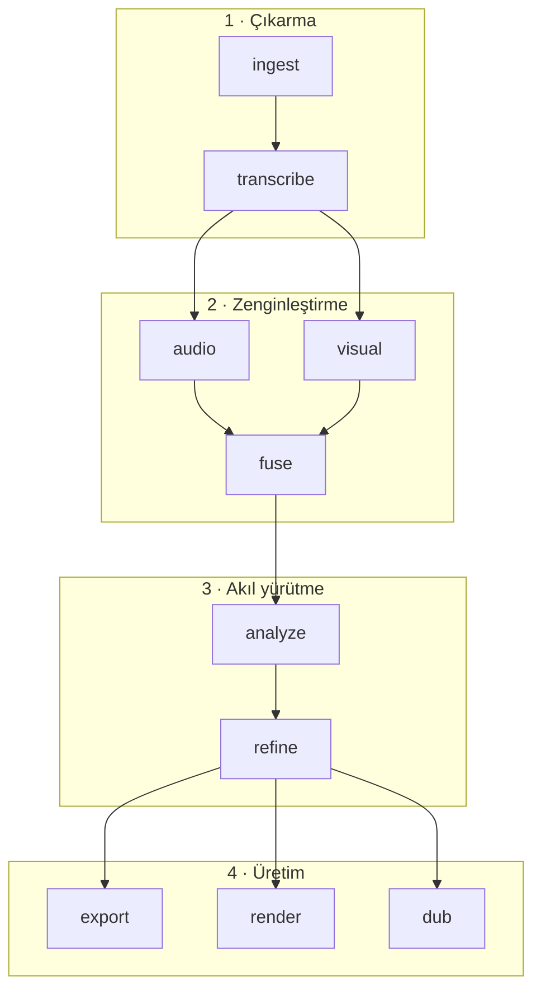

# long-to-shorts

Uzun bir YouTube videosunu indirir, deşifre eder ve hangi bölümlerin short, YouTube bölümü ya da podcast parçası olabileceğini önerir. Beğendiğin önerileri kesip klip haline getirir.

İşin çoğu bilgisayarında çalışır: transkript Apple Silicon'da (Metal), ses analizi ve kesim/render yerelde. Sadece hangi anların seçileceğine karar verirken Claude API kullanılır. Bulut sunucu, kuyruk ya da GPU kiralama yok.

---

## İçindekiler

1. [Özellikler](#özellikler)
2. [Gereksinimler](#gereksinimler)
3. [Kurulum](#kurulum)
4. [Hızlı başlangıç](#hızlı-başlangıç)
5. [Boru hattı sırası](#boru-hattı-sırası)
6. [Komut referansı](#komut-referansı)
7. [Dosyalar](#dosyalar)
8. [Marka ve kapak ayarları](#marka-ve-kapak-ayarları)
9. [Çalışma mantığı ve katmanlar](#çalışma-mantığı-ve-katmanlar)
10. [Performans](#performans)
11. [Ortam değişkenleri](#ortam-değişkenleri)
12. [Sınırlamalar](#sınırlamalar)

---

## Özellikler

Üç formatta aday üretir:

- **Short** — 12–60 sn, dikey (9:16). Tek bir ana odaklanan kısa kesitler. Render'da yüz tespitiyle dikey yerleşim yapılır.
- **YouTube bölümü** — 1,5–15 dk. Başı ve sonu olan, kendi içinde bütün konu blokları.
- **Podcast parçası** — 15–30 dk. Sesle takip edilebilen, daha uzun sohbet blokları.

Bunun dışında:

- **Segment seçimi.** Transkript, ses enerjisi ve (açıksa) sahne bilgisi Claude'a verilir. Her aday için puan (0–100), başlık, hook, açıklama ve gerekçe döner. Öncelik seçilebilir: viral, educational, emotional, balanced.
- **Dikey yerleşim.** Short render'ında YuNet ile yüz tespiti yapılır: tek kişide yüze yakın kırpma, iki kişide alt/üst yerleşim. `--no-layout` ile kapatılır.
- **Altyazı.** Kelime kelime gömülü altyazı; kaynak dilde otomatik, dublajda hedef dilde. `--no-captions` ile kapatılır.
- **Açılış kapağı.** Klibin başına ~2 sn'lik başlık + hook kapağı eklenir. Görünümü `brand.json`'dan ayarlarsın, beş hazır stil var (classic, minimal, bold, gradient, photo). `--no-cover` ile kapatılır.
- **Temiz kesim (pad).** Kesim noktaları sessizliğe yaslanır, ses fade'lenir; cümle ortasında başlama/bitme olmaz. `--no-pad` ile kapatılır.
- **Dublaj.** Seçilen klip Claude ile çevrilir, Kokoro TTS ile seslendirilir. Diller: en, en-gb, es, fr, it, pt, hi. Çok kişili kliplerde pyannote ile konuşmacı başına ayrı ses kullanılır (`HF_TOKEN` gerekir; yoksa tek ses). `produce --lang en` ile dikey klip + dublaj + altyazı + kapak tek komutta gelir.
- **Yerel kütüphane.** İşlenen videolar, adım durumları ve öneriler `library.sqlite`'da tutulur. Biten adımlar atlanır, `--force` ile yeniden yapılır.

Çıktılar `~/Desktop/long-to-shorts/<video_id>/` altına yazılır: export `clips/`, render `renders/`, dub `dubs/`.

---

## Gereksinimler

**Donanım:** macOS, Apple Silicon (M1–M4), en az 8 GB RAM (uzun videolarda 16 GB önerilir), yeterli disk alanı.

**Araçlar:** [Homebrew](https://brew.sh), [ffmpeg](https://ffmpeg.org), [uv](https://docs.astral.sh/uv/).

**API anahtarları:**

| Anahtar | Zorunlu? | Ne için? |
|---------|----------|----------|
| `ANTHROPIC_API_KEY` | Evet | Segment seçimi, puanlama, dublaj çevirisi |
| `HF_TOKEN` | Hayır | Konuşmacı ayrımı, kişi başına farklı ses |

---

## Kurulum

```bash
git clone https://github.com/<kullanıcı>/long-to-shorts.git
cd long-to-shorts

brew install ffmpeg
uv sync --all-extras

cp .env.example .env
uv run l2s set-anthropic    # veya .env içine elle yaz

uv run l2s init
```

> `uv sync --all-extras` olmadan tam boru hattı çalışmaz. İlk transkriptte Whisper modeli indirilir (~1–2 GB).

---

## Hızlı başlangıç

```bash
# Uçtan uca: indir → analiz et → ilk iki short'u render et
uv run l2s run "https://youtube.com/watch?v=..." --render short:1,short:2

# Önerileri gör
uv run l2s recs <video_id>

# Tek bir öneriyi İngilizce dublajlı reel olarak üret
uv run l2s produce <video_id> 14 --lang en
```

Tercihlerle daraltma:

```bash
uv run l2s run "<url>" \
  --formats short \
  --count 8 \
  --priority viral \
  --focus "girişimcilik" \
  --exclude "reklam,sponsor" \
  --render short:1,short:2
```

---

## Boru hattı sırası

Ana akış — sıra önemlidir:

```
ingest → transcribe → audio → [visual] → fuse → analyze → [export | render | dub]
```

| # | Adım | Çıktı | Katman |
|---|------|-------|--------|
| 1 | `ingest` | video.mp4, audio.wav, meta.json | Çıkarma |
| 2 | `transcribe` | transcript.json | Çıkarma |
| 3 | `audio` | audio_signals.json | Zenginleştirme |
| 4 | `visual` *(opsiyonel)* | visual_signals.json | Zenginleştirme |
| 5 | `fuse` | fused.json | Zenginleştirme |
| 6 | `analyze` | recommendations.json | Akıl yürütme |
| 7 | `export` / `render` / `dub` | clips / renders / dubs | Üretim |

**Notlar:**
- `visual`, `fuse`'dan önce çalışmalıdır.
- `fuse`, `run` içinde her seferinde yeniden çalışır (diğer adımlar atlanabilir).
- `diarize` ana akışın dışındadır; dublajda konuşmacı ayrımı için kullanılır.
- `recs`, `list`, `status` dosya üretmez — yalnızca okur.

---

## Komut referansı

### Boru hattı

```bash
uv run l2s ingest "<url>"
uv run l2s transcribe <video_id>
uv run l2s audio <video_id>
uv run l2s visual <video_id>          # opsiyonel
uv run l2s fuse <video_id>
uv run l2s analyze <video_id> [bayraklar]
uv run l2s diarize <video_id>         # opsiyonel; HF_TOKEN gerekir
```

### Üretim

```bash
uv run l2s export  <video_id> --pick short:1
uv run l2s render  <video_id> --pick short:1,short:2
uv run l2s produce <video_id> 14,16 [--lang en]
uv run l2s dub     <video_id> <rec_id> [--lang en]
```

### Seçim sözdizimi (`--pick`, `--render`)

| İfade | Anlam |
|-------|-------|
| `short:1` | En yüksek puanlı short |
| `short:1,short:2` | İlk iki short |
| `short` / `episode` / `podcast` | O formattaki tümü |
| `all` | Tüm öneriler |
| `14,16` | `recs` çıktısındaki ID (`produce` ile) |

### `run`

```
URL → ingest → transcribe → audio → [visual] → fuse → analyze → [render]
```

| Bayrak | Açıklama |
|--------|----------|
| `--render short:1,...` | Bitişte render |
| `--visual` | Sahne tespiti (yavaş) |
| `--force` | Tamamlanmış adımları yeniden yap |
| `--formats short,episode,podcast` | Format filtresi |
| `--count N` | Format başına adet |
| `--priority viral\|educational\|emotional\|balanced` | Seçim önceliği |
| `--focus "konu"` | Konu odağı |
| `--exclude "reklam,jenerik"` | Atlanacak içerik |
| `--no-captions` | Render'da altyazı kapalı |
| `--no-layout` | Dikey yerleşim kapalı |
| `--no-intro` | Açılış kapağı kapalı |

> `run` komutunda `--no-pad` yoktur; pad yalnızca `render` / `produce`'da kullanılır.

### `analyze`

| Bayrak | Açıklama |
|--------|----------|
| `--formats short,episode,podcast` | Üretilecek formatlar |
| `--count N` | Format başına hedef adet |
| `--priority viral\|educational\|emotional\|balanced` | Öncelik |
| `--focus "konu"` | Konu odağı |
| `--exclude "reklam,jenerik"` | Atlanacak konular |

### `export`

| Bayrak | Açıklama |
|--------|----------|
| `--pick` *(zorunlu)* | Seçim ifadesi |
| `--vertical` / `--no-vertical` | Short'ta 9:16 kırpma (varsayılan: açık) |

### `render`

| Bayrak | Açıklama |
|--------|----------|
| `--pick` *(zorunlu)* | Seçim ifadesi |
| `--no-layout` | Yüz-farkında yerleşim kapalı |
| `--no-captions` | Altyazı kapalı |
| `--no-cover` / `--no-intro` | Açılış kapağı kapalı |
| `--no-pad` | Sessizlik yaslama + fade kapalı |

### `produce`

| Bayrak | Açıklama |
|--------|----------|
| `--no-layout` | Dikey yerleşim kapalı |
| `--no-captions` | Altyazı kapalı |
| `--no-cover` / `--no-intro` | Kapak kapalı |
| `--lang en` | Dublajlı reel (en, es, fr, it, pt, hi) |

### `dub`

| Bayrak | Açıklama |
|--------|----------|
| `--lang en` | Hedef dil (varsayılan: en) |
| `--no-captions` | Hedef-dil altyazısı kapalı |
| `--no-per-speaker` | Tek ses (diarization kapalı) |
| `--speakers 2` | Konuşmacı sayısı ipucu |

### Kütüphane ve yapılandırma

```bash
uv run l2s list
uv run l2s status <video_id>
uv run l2s recs <video_id>
uv run l2s init
uv run l2s set-anthropic
uv run l2s set-hf
```

---

## Dosyalar

### Proje kökü

```
long-to-shorts/
├── app/               # boru hattı modülleri
├── brand/             # logo, renkler, kapak şablonu
├── prompts/           # Claude sistem promptları
├── data/              # video başına ara dosyalar (gitignore)
├── library.sqlite     # kütüphane (gitignore)
└── .env               # API anahtarları (gitignore)
```

### `data/<video_id>/`

| Dosya | Adım | Anlam |
|-------|------|-------|
| `video.mp4` | ingest | Kaynak video (≤1080p) |
| `audio.wav` | ingest | 16 kHz mono ses |
| `meta.json` | ingest | Başlık, kanal, süre, bölümler |
| `transcript.json` | transcribe | Kelime düzeyinde transkript — **omurga** |
| `audio_signals.json` | audio | Enerji eğrisi, duraklamalar |
| `visual_signals.json` | visual | Sahne kesimleri |
| `fused.json` | fuse | Tüm sinyallerin birleşimi |
| `recommendations.json` | analyze | Claude önerileri |
| `speakers.json` | diarize | Konuşmacı ayrımı |

### Nihai çıktılar (Masaüstü)

```
~/Desktop/long-to-shorts/<video_id>/
├── clips/      # export  — ham kesim
├── renders/    # render  — yayınlanabilir klip
└── dubs/       # dub     — dublajlı klip
```

`L2S_OUTPUT_DIR` ile konum değiştirilebilir.

### `library.sqlite`

- **videos** — video metadata
- **stages** — boru hattı durumu (`ingest`, `transcribe`, `audio`, `visual`, `fuse`, `analyze`, `export`, `render`, `dub`, `diarize`)
- **recommendations** — öneriler ve üretim paketleri

---

## Marka ve kapak ayarları

Kapak ve marka kimliği `brand/brand.json` + `brand/logo.png` ile yönetilir.

```jsonc
{
  "accent": "#FF4D2E",
  "channel": "KANAL ADIN",
  "cover": {
    "style": "gradient",           // classic | minimal | bold | gradient | photo
    "bg": ["#0B1220", "#1B3A6B"], // düz renk | gradyan | "brand/kapak.jpg"
    "bg_dir": "vertical",
    "title_color": "#FFFFFF",
    "subtitle_color": "#C2C6D2",
    "accent_style": "line",        // line | bar | none
    "logo_pos": "top-center",
    "align": "center",
    "vpos": "center"
  }
}
```

| Stil | Görünüm |
|------|---------|
| classic | Koyu düz arka plan, ortalanmış metin (varsayılan) |
| minimal | Sade, logo sol üst, metin altta |
| bold | Büyük başlık, sol accent bar |
| gradient | İki renkli gradyan |
| photo | Görsel arka plan + karartma |

Kapak render sırasında önerinin başlık ve hook metniyle otomatik üretilir.

---

## Çalışma mantığı ve katmanlar



**Katman 1 — Çıkarma:** yt-dlp ile indirme; mlx-whisper ile Metal üzerinde transkript.

**Katman 2 — Zenginleştirme:** librosa ile ses enerjisi ve duraklamalar; (opsiyonel) sahne kesimleri; `fuse` ile transkript omurgasına hizalama.

**Katman 3 — Akıl yürütme:** Claude segment seçimi; kod tarafında `refine` — süre sınırları, segment yaslama, çakışma eleme.

**Katman 4 — Üretim:** export (ham), render (yayınlanabilir), dub (çeviri + TTS). Hepsi analyze sonrası bağımsız çalışır.

---

## Performans

Ölçüm: **Apple M2 · 8 çekirdek (4P+4E) · 16 GB RAM · macOS · Metal (MPS)**. Aşamalar **sıralı** çalışır; bellek toplanmaz.

**Kaynak uzunluğuna bağlı** (8.8 dk = 528 sn video üzerinde ölçüldü):

| Aşama | Süre | Tepe bellek | Yük |
|-------|------|-------------|-----|
| ingest (indirme) | ağ-bağımlı | düşük | ağ + disk |
| transcribe | 94 sn | 569 MB | Metal GPU + CPU (en ağır işlem) |
| audio | 2.5 sn | 402 MB | CPU (librosa) |
| fuse | 0.1 sn | 32 MB | ihmal edilebilir |
| analyze | 52 sn | 72 MB | yerel yük ~yok; Claude API'yi bekler |

Transkript hızı: gerçek zamanın **~5.6 katı** (528 sn ses → 94 sn).

**Klip başına** (kaynak uzunluğundan bağımsız, ~58 sn'lik klip):

| Aşama | Süre | Tepe bellek | Yük |
|-------|------|-------------|-----|
| render (1 short) | 18 sn | 693 MB | ffmpeg (çok çekirdek) + YuNet + Pillow |
| dub (1 short, EN) | 62 sn | 2.4 GB | pyannote (MPS) + Kokoro TTS + çeviri API |

**~1 saatlik video tahmini** (≈6× ölçek): transcribe ~9.5 dk, analyze ~2–3 dk → **öneriler ~12–13 dk içinde hazır**; sonra her klip render ~18 sn, dub ~1 dk.

Tek seferde en yüksek bellek **~2.4 GB** (dub). **16 GB rahat; 8 GB yeterli.** Bekleme ağırlıkla transkriptte; `analyze`/`dub` sırasında makine ağ/Claude'u bekler, boşta kalır.

---

## Ortam değişkenleri

```bash
ANTHROPIC_API_KEY=sk-ant-...          # zorunlu
CLAUDE_MODEL=claude-opus-4-8          # opsiyonel
WHISPER_MODEL=mlx-community/whisper-large-v3-turbo
HF_TOKEN=hf_...                        # konuşmacı ayrımı / dublaj
L2S_OUTPUT_DIR=/path/to/output        # varsayılan: ~/Desktop/long-to-shorts
```

---

## Sınırlamalar

- **Platform:** yalnızca macOS (Apple Silicon).
- **Podcast:** en az 15 dakika; daha kısa bloklar podcast olarak önerilmez.
- **Dublaj:** Kokoro dilleriyle sınırlı; Türkçe hedef dil henüz yok.
- **Görsel analiz:** sahne kesimi mevcut; OCR ve vision planlanıyor.
- **Claude maliyeti:** analyze ve dublaj çevirisi API kullanır; transkript ve render yereldir.
